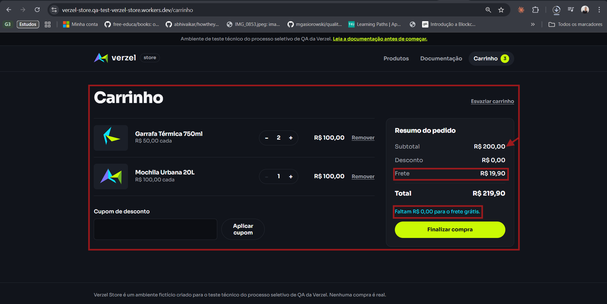
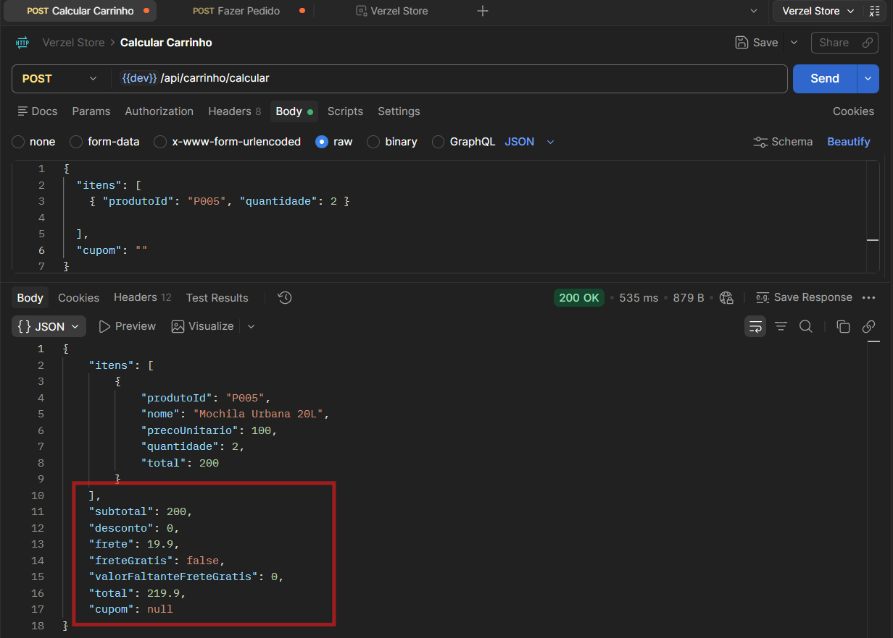

# BUG-001 — UI Frete não fica grátis para subtotal exatamente igual a R$ 200,00

| Campo | Valor |
|---|---|
| **Severidade / Prioridade** | Alta / Alta |
| **Camada** | UI | API |
| **Critério / regra violada** | CA06 — O frete é grátis para compras com subtotal a partir de R$ 200,00, inclusive. |
| **Caso de teste** | CT-FRT-002 |
| **Ambiente** | https://verzel-store.qa-test-verzel-store.workers.dev/ · Chrome _139.0.7258.128_ · Windows · 07/10/2026 |
| **É limitação documentada?** | Não — conferido em "Sobre o teste" |

## Pré-condições
Ter um carrinho com subtotal R$ 200,00.

## Passos para reproduzir
1. Montar subtotal de R$ 200,00.
2. Observar frete.

## Resultado esperado
_Após incluir os produtos e gerar um subtotal de R$ 200,00 no carrinho o sistema deve informar frete grátis_
- Subtotal: R$ 200,00
- Frete: R$ 0,00
- Total: R$ 200,00

## Resultado obtido
_Após incluir os produtos e gerar um subtotal de R$ 200,00 no carrinho o sistema não descontou o frete_
- Subtotal: R$ 200,00
- Frete: R$ 19,90
- Total: R$ 219,90
- A aplicação ainda informa: "Faltam R$ 0,00 para o frete grátis."
- O mesmo ocorre na API conforme evidência abaixo.

## Evidências

- _(API)_ requisição/resposta:

## Impacto
_A própria tela confirma o subtotal de R$ 200,00, mas aplica R$ 19,90 de frete. Portanto, não é apenas uma divergência visual: a regra de negócio está sendo aplicada incorretamente._

