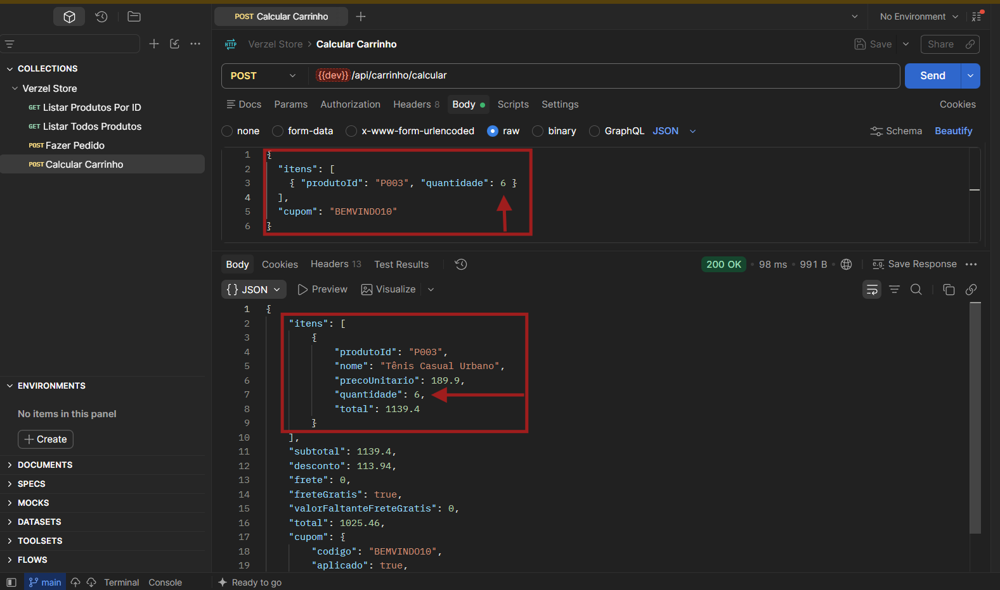

# BUG-002 — API permite quantidade superior ao limite de 5 unidades por produto

| Campo | Valor |
|---|---|
| **Severidade / Prioridade** | Alta / Alta |
| **Camada** | API |
| **Critério / regra violada** | CA10 — O limite de quantidade por produto é de no máximo 5 unidades. |
| **Caso de teste** | CT-QTD-004 |
| **Ambiente** | `https://verzel-store.qa-test-verzel-store.workers.dev/` · API `POST /api/carrinho/calcular` & `POST /api/pedidos` · 07/10/2026 |
| **É limitação documentada?** | Não — conferido em "Sobre o teste" |

## Pré-condições

Ter um produto válido disponível e acesso ao endpoint de cálculo do carrinho e no finalizar pedido.

## Passos para reproduzir

1. Enviar uma requisição `POST` para `/api/carrinho/calcular`.
2. Informar o produto `P003`.
3. Informar quantidade `6`.
4. Enviar o cupom `BEMVINDO10`.
5. Observar a resposta da API.

Rota de pedidos
1. Enviar uma requisição `POST` para `/api/pedidos`.
2. Informar o produto `P005`.
3. Informar quantidade `7`.
4. Enviar o cupom `BEMVINDO10`.
5. Observar a resposta da API.

## Resultado esperado

*Após solicitar 6 unidades de um mesmo produto, a API deve impedir a quantidade superior ao limite estabelecido de 5 unidades.*

- Quantidade máxima permitida por produto: 5 unidades.
- A quantidade `6` não deve ser aceita pela API.
- O carrinho não deve ser calculado mantendo 6 unidades do mesmo produto.

## Resultado obtido

*A API aceitou a quantidade de 6 unidades do produto `P003` e retornou `200 OK`, calculando normalmente o carrinho.*

- Produto: `P003` — Tênis Casual Urbano
- Preço unitário: R$ 189,90
- Quantidade enviada: **6**
- Quantidade retornada: **6**
- Subtotal: R$ 1.139,40
- Desconto: R$ 113,94
- Frete: R$ 0,00
- Frete grátis: `true`
- Total: R$ 1.025,46
- Status HTTP: `200 OK`

*A API aceitou a quantidade de 7 unidades do produto `P005` e retornou `200 OK`, realizando normalmente o pedido.*

- Produto: `P005` — Mochila Urbana 20L
- Preço unitário: R$ 100,00
- Quantidade enviada: **7**
- Quantidade retornada: **7**
- Subtotal: R$ 700,00
- Desconto: R$ 70
- Frete: R$ 0,00
- Frete grátis: `true`
- Total: R$ 630,00
- Status HTTP: `200 OK`

## Evidências




- *(API)* requisição carrinho:
```json
{
  "items": [
    {
      "produtoId": "P003",
      "quantidade": 6
    }
  ],
  "cupom": "BEMVINDO10"
}
```
---
```json
{
  "items": [
    {
      "produtoId": "P003",
      "nome": "Tênis Casual Urbano",
      "precoUnitario": 189.9,
      "quantidade": 6,
      "total": 1139.4
    }
  ],
  "subtotal": 1139.4,
  "desconto": 113.94,
  "frete": 0,
  "freteGratis": true,
  "valorFaltanteFreteGratis": 0,
  "total": 1025.46,
  "cupom": {
    "codigo": "BEMVINDO10",
    "aplicado": true
  }
}
```
---
- *(API)* requisição pedido:
```json
{
  "cliente": {
    "nome": "Maria Silva",
    "email": "maria@exemplo.com",
    "cep": "01310-100"
  },
  "itens": [
    { "produtoId": "P005", "quantidade": 7 }
  ],
  "cupom": "  BEMVINDO10"
}
```
```json
{
    "numero": "VZ-887372",
    "criadoEm": "2026-10-08T04:00:04.363Z",
    "cliente": {
        "nome": "Maria Silva",
        "email": "maria@exemplo.com",
        "cep": "01310100"
    },
    "itens": [
        {
            "produtoId": "P005",
            "nome": "Mochila Urbana 20L",
            "precoUnitario": 100,
            "quantidade": 7,
            "total": 700
        }
    ],
    "subtotal": 700,
    "desconto": 70,
    "frete": 0,
    "freteGratis": true,
    "valorFaltanteFreteGratis": 0,
    "total": 630,
    "cupom": {
        "codigo": "BEMVINDO10",
        "aplicado": true,
        "mensagem": "Cupom aplicado: 10% de desconto nos produtos."
    }
}
```
---

## Rastreabilidade
- CA10 — Limite máximo de 5 unidades por produto.
- CT-QTD-002 — Adição de exatamente 5 unidades pela UI.
- CT-QTD-003 — Tentativa de adicionar 6 unidades pela UI.
- CT-API-QTD-005 — Solicitação de exatamente 5 unidades pela API.
- CT-API-QTD-007 — Solicitação de 6 unidades pela API.
- BUG-002 — Falha de validação do limite na API.

---
## Impacto

A API permite contornar a regra de negócio de limite de quantidade por produto. Embora a regra estabeleça o máximo de 5 unidades, uma requisição direta à API consegue enviar e manter 6 ou mais unidades do mesmo produto.

Esse comportamento representa uma inconsistência na camada de API e permite que a regra seja contornada mesmo que a interface de usuário impeça a seleção de quantidades superiores a 5 unidades.