# Documento de evidências da execução

> Consolida, por caso de teste, o que foi feito e o que foi observado. As imagens ficam em [`../evidence`](../evidence); o resultado de cada caso está em [`execucao-dos-testes.md`](execucao-dos-testes.md).

> **Status:** ⬜ Não Executado · ✅ Passou · ❌ Falhou · ⚠️ Passou com ressalva / ambiguidade · ⛔ Bloqueado

## Como ler

Cada bloco traz: **objetivo → dados usados → passos → resultado obtido → evidência → veredito**.

---

# CEN-CUP — Aplicação e validação de cupons

## CT-CUP-001 — Aplicar cupom válido

- **Critério:** CA01
- **Técnica:** Particionamento de Equivalência
- **Prioridade:** Alta
- **Pré-condições:** Carrinho com pelo menos um produto.
- **Dados de teste:** `BEMVINDO10`
- **Passo a passo:**
  1. Adicionar produto.
  2. Identificar subtotal.
  3. Aplicar `BEMVINDO10`.
  4. Observar desconto.
  5. Observar total.
- **Resultado esperado:**
  Cupom aceito; desconto de 10% sobre subtotal; desconto exibido corretamente; total recalculado.
- **Ponto de atenção / Dúvida:**
  Confirmar comportamento real da aplicação.
- **Resultado obtido:**
  O sistema aceitou o cupom e o desconto de 10% foi aplicado sobre o subtotal dos produtos e apresentado corretamente conforme evidência abaixo.
- **Evidência:**
  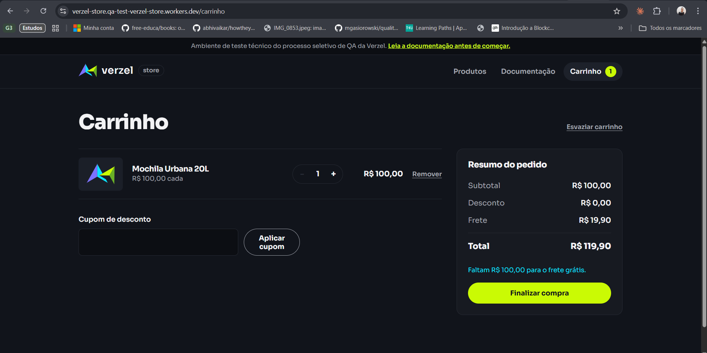
  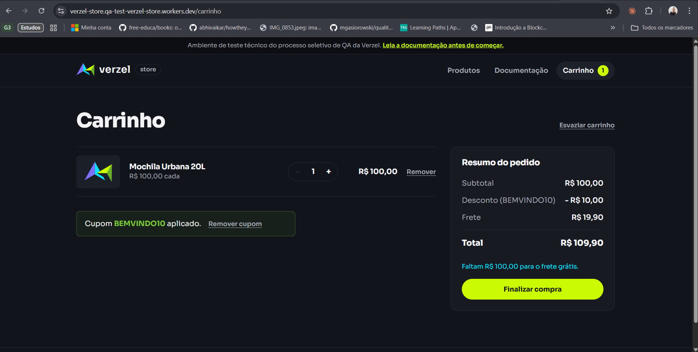
- **Status:** ✅ Passou
- **Observações:**
  *preencher durante a execução*

---

## CT-CUP-002 — Aplicar cupom utilizando letras minúsculas

- **Critério:** CA02
- **Técnica:** Particionamento de Equivalência
- **Prioridade:** Média
- **Pré-condições:** Carrinho com pelo menos um produto.
- **Dados de teste:** `bemvindo10`
- **Passo a passo:**
  1. Adicionar produto.
  2. Aplicar `bemvindo10`.
  3. Observar resultado.
- **Resultado esperado:**
  Cupom aceito e mesmo desconto produzido por `BEMVINDO10`.
- **Ponto de atenção / Dúvida:**
  Validar normalização case-insensitive.
- **Resultado obtido:**
  Cupom aplicado com sucesso mesmo escrito com letras minúsculas conforme evidência abaixo
- **Evidência:**
  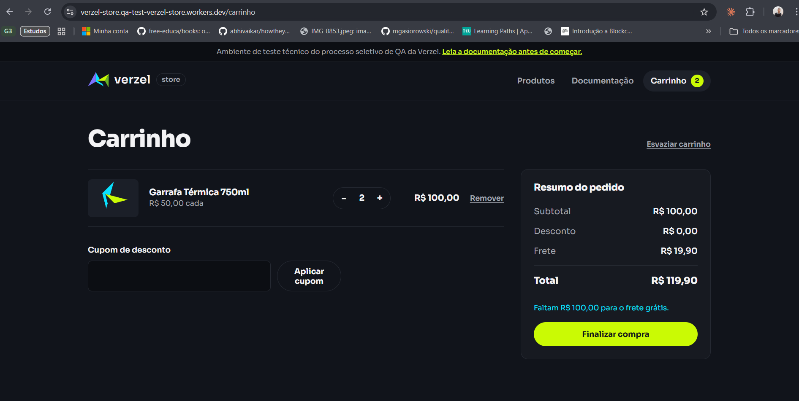
  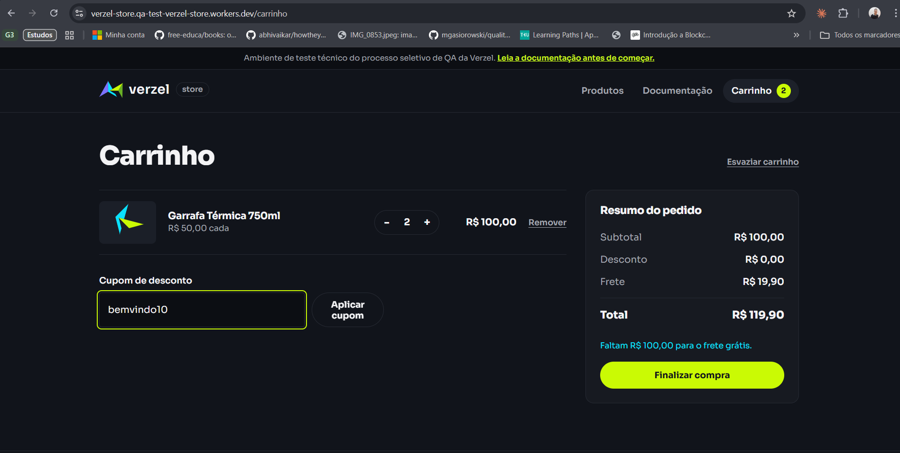
  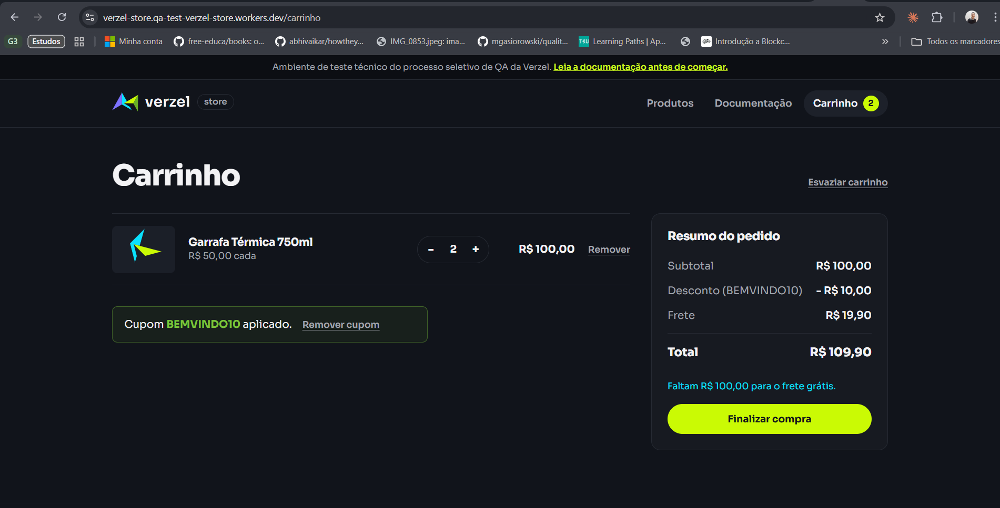
- **Status:** ✅ Passou
- **Observações:**
  *preencher durante a execução*

---

## CT-CUP-003 — Aplicar cupom com espaços no início

- **Critério:** CA02
- **Técnica:** Error Guessing
- **Prioridade:** Média
- **Pré-condições:** Carrinho com pelo menos um produto.
- **Dados de teste:** `   BEMVINDO10`
- **Passo a passo:**
  1. Adicionar produto.
  2. Aplicar cupom com espaços no início.
  3. Observar resultado.
- **Resultado esperado:**
  Espaço inicial ignorado e cupom aceito.
- **Ponto de atenção / Dúvida:**
  Confirmar tratamento de whitespace.
- **Resultado obtido:**
  Cupom aplicado com sucesso mesmo escrito com espaços no início conforme evidência abaixo.
- **Evidência:**
  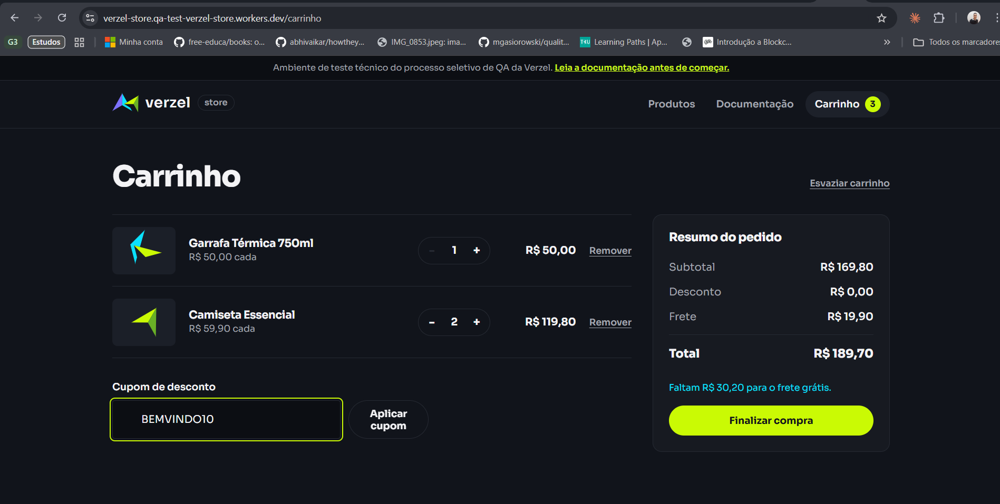
  
- **Status:** ✅ Passou
- **Observações:**
  *preencher durante a execução*

---

## CT-CUP-004 — Aplicar cupom com espaços no final

- **Critério:** CA02
- **Técnica:** Error Guessing
- **Prioridade:** Média
- **Pré-condições:** Carrinho com pelo menos um produto.
- **Dados de teste:** `BEMVINDO10`
- **Passo a passo:**
  1. Adicionar produto.
  2. Aplicar cupom com espaços no final.
  3. Observar resultado.
- **Resultado esperado:**
  Espaço final ignorado e cupom aceito.
- **Ponto de atenção / Dúvida:**
  Confirmar tratamento de whitespace.
- **Resultado obtido:**
  Cupom aplicado com sucesso mesmo escrito com espaços no final conforme evidência abaixo.
- **Evidência:**
  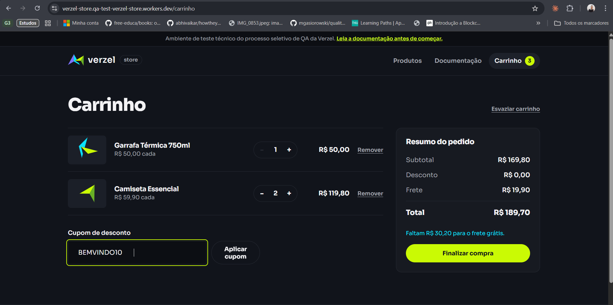
  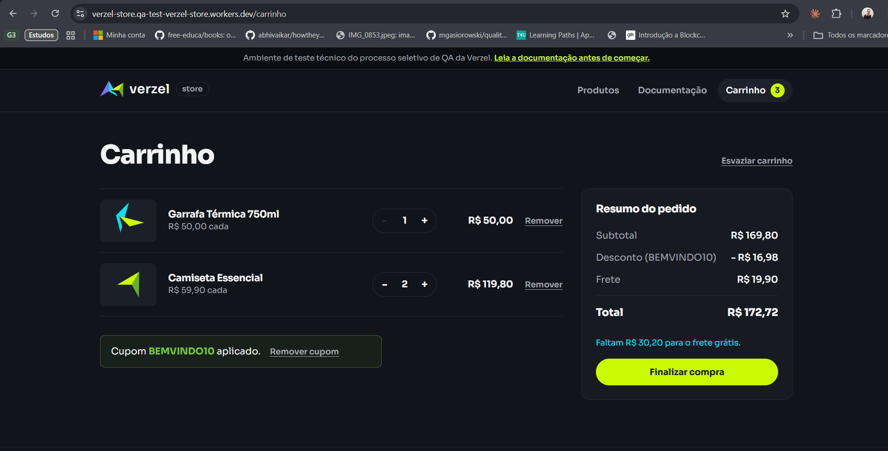
- **Status:** ✅ Passou
- **Observações:**
  *preencher durante a execução*

---

## CT-CUP-005 — Aplicar cupom inexistente

- **Critério:** CA03
- **Técnica:** Particionamento de Equivalência
- **Prioridade:** Alta
- **Pré-condições:** Carrinho com pelo menos um produto.
- **Dados de teste:** `CUPOMINEXISTENTE`
- **Passo a passo:**
  1. Adicionar produto.
  2. Aplicar cupom inexistente.
  3. Observar mensagem e valores.
- **Resultado esperado:**
  Rejeitar cupom; mensagem exatamente `Cupom inválido.`; nenhum desconto; valores sem desconto.
- **Ponto de atenção / Dúvida:**
  Validar mensagem exatamente como especificada.
- **Resultado obtido:**
  Ao tentar inserir um cupom inexistente o sistema retorna a mensagem de cupom inválido e não aplica qualquer desconto conforme evidência abaixo.
- **Evidência:**
  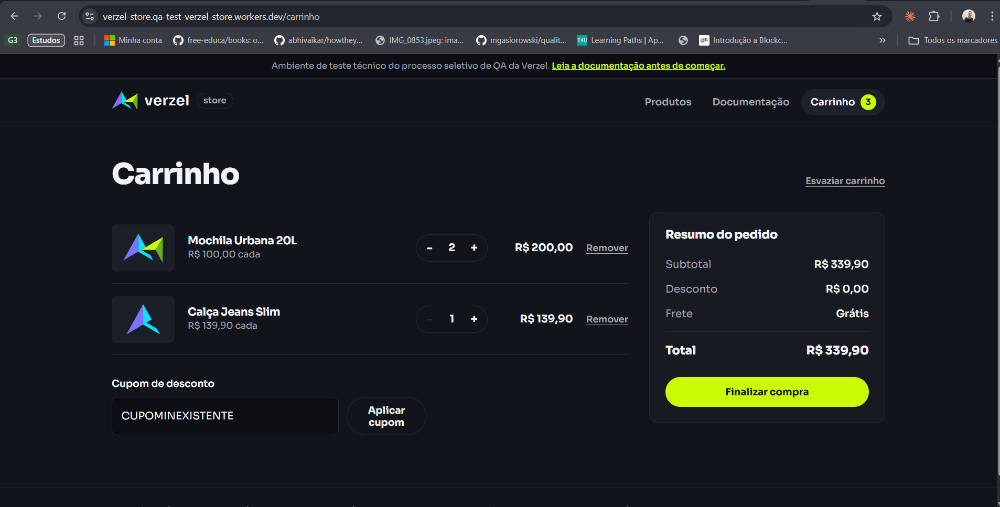
  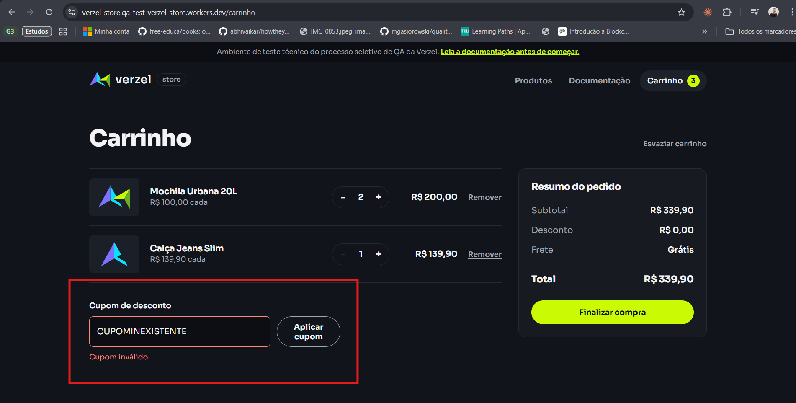
- **Status:** ✅ Passou
- **Observações:**
  *preencher durante a execução*

---

## CT-CUP-006 — Aplicar cupom expirado

- **Critério:** CA04
- **Técnica:** Particionamento de Equivalência
- **Prioridade:** Alta
- **Pré-condições:** Carrinho com pelo menos um produto.
- **Dados de teste:** Cupom expirado. `VERAO2026` 
- **Passo a passo:**
  1. Adicionar produto.
  2. Informar cupom expirado.
  3. Observar mensagem e valores.
- **Resultado esperado:**
  Rejeitar cupom; mensagem exatamente `Cupom expirado.`; nenhum desconto.
- **Ponto de atenção / Dúvida:**
  Código expirado não informado; obter da documentação/dados da aplicação.
- **Resultado obtido:**
  Ao tentar inserir um cupom expirado o sistema retorna a mensagem de cupom expirado e não aplica qualquer desconto conforme evidência abaixo.
- **Evidência:**
  
  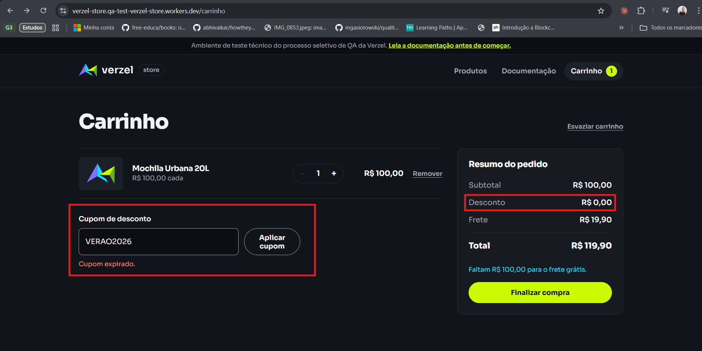
- **Status:** ✅ Passou
- **Observações:**
  *preencher durante a execução*

---

## CT-CUP-007 — Tentar aplicar segundo cupom sem remover o primeiro

- **Critério:** CA05
- **Técnica:** Transição de Estados
- **Prioridade:** Alta
- **Pré-condições:** Carrinho com produto e cupom A aplicável.
- **Dados de teste:** Cupom A + cupom B válidos, se disponibilizados.
- **Passo a passo:**
  1. Aplicar A.
  2. Sem remover A, tentar aplicar B.
  3. Observar estado e mensagem.
- **Resultado esperado:**
  Dois cupons não devem permanecer ativos simultaneamente.
- **Ponto de atenção / Dúvida:**
  Comportamento específico deve ser confirmado.
- **Resultado obtido:**
  Após a inserir um cupom o sistema disponibiliza apenas a opção remover cupom pois não é permitido dois cupons ativos simultaneamente conforme evidência abaixo.
- **Evidência:**
  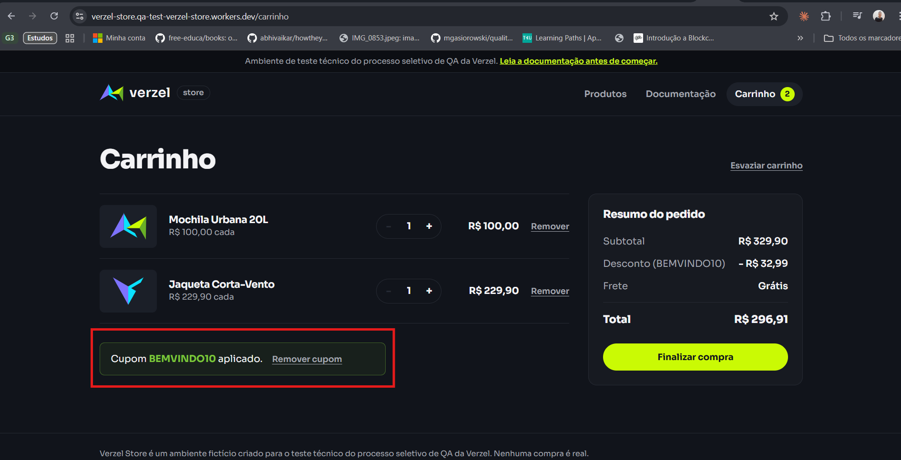
- **Status:** ✅ Passou
- **Observações:**
  *preencher durante a execução*

---

## CT-CUP-008 — Remover cupom e aplicar outro

- **Critério:** CA05
- **Técnica:** Transição de Estados
- **Prioridade:** Alta
- **Pré-condições:** Carrinho com produto e cupons A/B disponíveis.
- **Dados de teste:** Cupom A + cupom B.
- **Passo a passo:**
  1. Aplicar A.
  2. Remover A.
  3. Aplicar B.
  4. Recalcular carrinho.
- **Resultado esperado:**
  A deixa de produzir desconto; carrinho recalculado; B aplicado; somente B ativo.
- **Ponto de atenção / Dúvida:**
  Confirmar controles disponíveis para remoção.
- **Resultado obtido:**
  Após inserir o cupom o sistema disponibiliza um botao "Remover cupom", após clicar em remover o sistema recalcula o carrinho e remove o desconto aplicado conforme evidência abaixo.
- **Evidência:**
  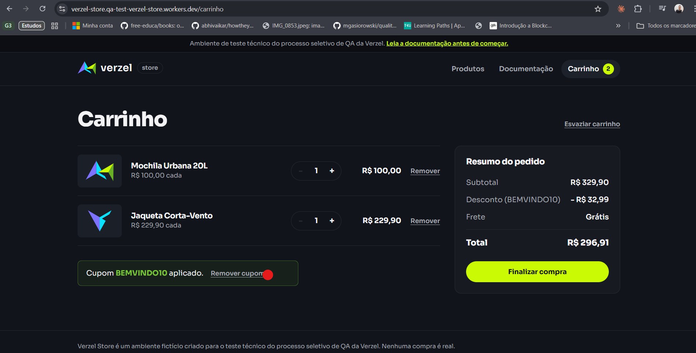
  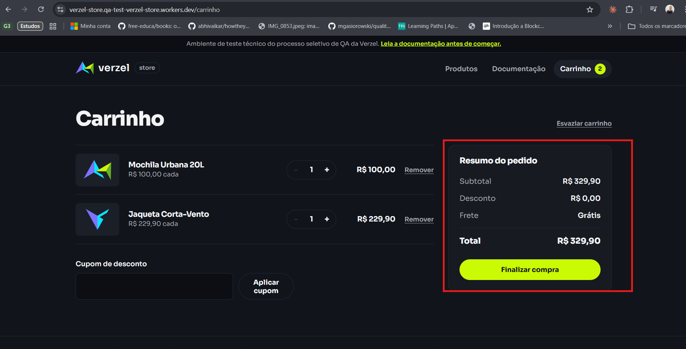
- **Status:** ✅ Passou
- **Observações:**
  Não foram disponibilizados dois cupons válidos para inserir um desconto de 10% remover e depois inserir outro de 15% por exemplo, para verificar a consistência dos cálculos
  
  Vamos verificar na API se é possível incluir.

---

# CEN-FRT — Cálculo e elegibilidade de frete

## CT-FRT-001 — Subtotal abaixo de R$ 200,00

- **Critério:** CA07
- **Técnica:** Particionamento de Equivalência / Análise do valor limite
- **Prioridade:** Alta
- **Pré-condições:** Carrinho com subtotal abaixo de R$ 200,00.
- **Dados de teste:** Subtotal R$ 199,90.
- **Passo a passo:**
  1. Montar um carrinho com subtotal de R$ 199,90.
  2. Observar frete.
  3. Observar valor faltante.
- **Resultado esperado:**
  Frete R$ 19,90; informar quanto falta para frete grátis.
- **Ponto de atenção / Dúvida:**
  Confirmar formato de apresentação do valor faltante.
- **Resultado obtido:**
  Após montar um carrinho com subtotal de 199,90 o sistema não remove a cobrança do frete e apresenta uma mensagem "Faltam R$0,10 para o frete grátis conforme evidência abaixo"
- **Evidência:**
  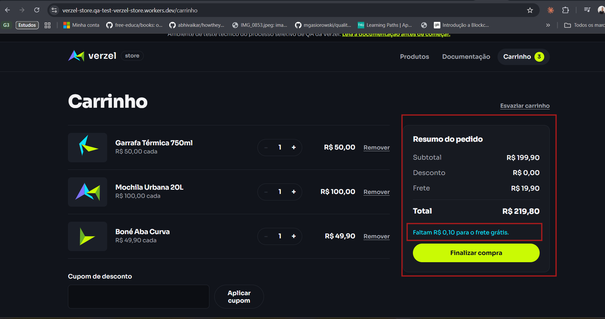
- **Status:** ⚠️ Passou com ressalva
- **Observações:**
  Durante a execução nao conseguimos montar um carrinho com o valor de R$ 199,99 para cobrir a tecnica de analise do valor limite, dessa forma o valor mais próximo do limite foi R$ 199,90, neste caso é necessário verificar como o sistema se comporta no limite de R$ 199,99.

---

## CT-FRT-002 — Subtotal exatamente R$ 200,00

- **Critério:** CA06
- **Técnica:** Valor Limite
- **Prioridade:** Crítica
- **Pré-condições:** Carrinho com subtotal exato de R$ 200,00.
- **Dados de teste:** Subtotal R$ 200,00.
- **Passo a passo:**
  1. Montar um carrinho com subtotal de R$ 200,00.
  2. Observar frete.
- **Resultado esperado:**
  Frete R$ 0,00; frete grátis.
- **Ponto de atenção / Dúvida:**
  Caso crítico de limite.
- **Resultado obtido:**
  _Após incluir os produtos e gerar um subtotal de R$ 200,00 no carrinho o sistema não descontou o frete
  Subtotal: R$ 200,00
  Frete: R$ 19,90
  Total: R$ 219,90
  A aplicação ainda informa: "Faltam R$ 0,00 para o frete grátis."_
- **Evidência:**
  
- **Bug ID:**
  BUG-001 | [`bugs/BUG-001/`](../bugs/BUG-001.md) 
- **Status:** ❌ Falhou
- **Observações:**
  Abertura do BUG-001 para investigação pelo time de desenvolvimento.

---

## CT-FRT-003 — Subtotal acima de R$ 200,00

- **Critério:** CA06
- **Técnica:** Valor Limite
- **Prioridade:** Alta
- **Pré-condições:** Carrinho com subtotal acima de R$ 200,00.
- **Dados de teste:** Subtotal R$ 209,40.
- **Passo a passo:**
  1. Montar um carrinho com subtotal de R$ 209,40.
  2. Observar frete.
- **Resultado esperado:**
  Frete R$ 0,00 frete grátis.
- **Resultado obtido:**
  Subtotal R$ 209,40.
  Frete R$ 0,00 frete grátis.
- **Evidência:**
  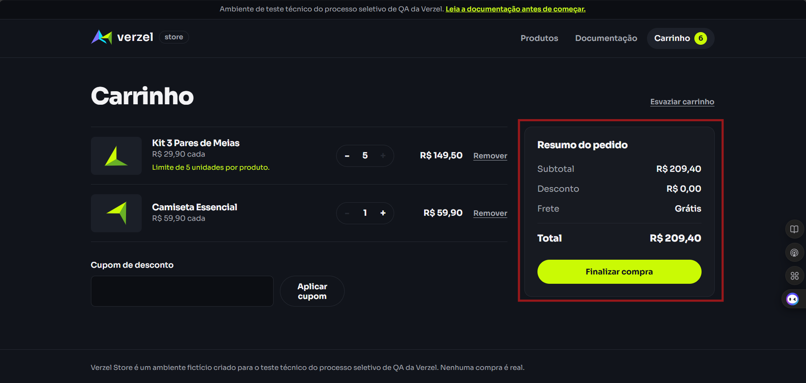

- **Status:** ⚠️ Passou com ressalva
- **Observações:**
  Durante a execução o valor mais próximo do limite de R$ 200,01 que conseguimos alcançar foi R$ 209,40, nesse caso é necessário checar o comportamento do sistema com o valor R$ 200,01 pois é exatamente o limite na regra de negócio.

---

## CT-FRT-004 — Subtotal imediatamente abaixo do limite

- **Critério:** CA07
- **Técnica:** Valor Limite
- **Prioridade:** Alta
- **Pré-condições:** Carrinho com subtotal exato de R$ 199,99.
- **Dados de teste:** Subtotal R$ 199,99.
- **Passo a passo:**
  1. Montar subtotal de R$ 199,99.
  2. Observar frete.
  3. Observar valor faltante.
- **Resultado esperado:**
  Frete R$ 19,90; falta exatamente R$ 0,01 para frete grátis.
- **Ponto de atenção / Dúvida:**
  Validar precisão monetária.
- **Resultado obtido:**
  *preencher durante a execução*
- **Evidência:**
  ### N/A
- **Status:** ⛔ Bloqueado
- **Observações:**
  *Será necessário uma combinação de produtos para validar esse cenário que de o valor exato de R$ 199,99 pois o mais próximo que conseguimos alcançar foi de 199,90*

---

## CT-FRT-005 — Subtotal significativamente abaixo do limite

- **Critério:** CA07
- **Técnica:** Particionamento de Equivalência
- **Prioridade:** Média
- **Pré-condições:** Carrinho com subtotal abaixo do limite.
- **Dados de teste:** Subtotal R$ 150,00.
- **Passo a passo:**
  1. Montar subtotal de R$ 150,00.
  2. Observar frete.
  3. Observar valor faltante.
- **Resultado esperado:**
  Frete R$ 19,90; falta R$ 50,00 para frete grátis.
- **Ponto de atenção / Dúvida:**
  Validar cálculo do valor faltante.
- **Resultado obtido:**
  Subtotal R$ 169,90.
  Frete R$ 19,90 falta R$ 50,00 para frete grátis.
- **Evidência:**
  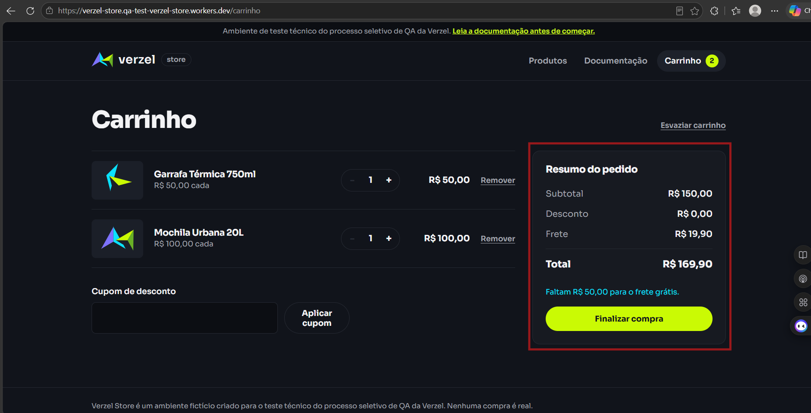

- **Status:** ✅ Passou
- **Observações:**
  Sem observações

---

## CT-FRT-006 — Frete deve considerar subtotal antes do desconto

- **Critério:** CA08
- **Técnica:** Tabela de Decisão / Regra de Negócio
- **Prioridade:** Crítica
- **Pré-condições:** Subtotal acima de R$ 200,00; cupom disponível.
- **Dados de teste:** R$ 209,40 + `BEMVINDO10`
- **Passo a passo:**
  1. Montar R$ 209,40.
  2. Aplicar `BEMVINDO10`.
  3. Validar desconto.
  4. Validar subtotal após desconto.
  5. Validar frete.
  6. Validar total.
- **Resultado esperado:**
  Subtotal R$ 209,40; desconto R$ 20,94; subtotal pós-desconto R$ 188,46; frete R$ 0,00; total R$ 188,46.
- **Ponto de atenção / Dúvida:**
  Frete considera subtotal antes do desconto; não recalcular com R$ 188,46.
- **Resultado obtido:**
  Subtotal R$ 209,40; desconto R$ 20,94; subtotal pós-desconto R$ 188,46; frete R$ 0,00; total R$ 188,46.
- **Evidência:**
  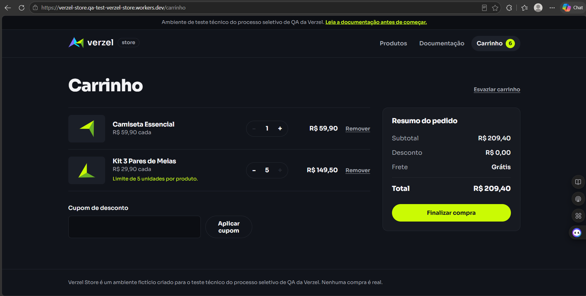
  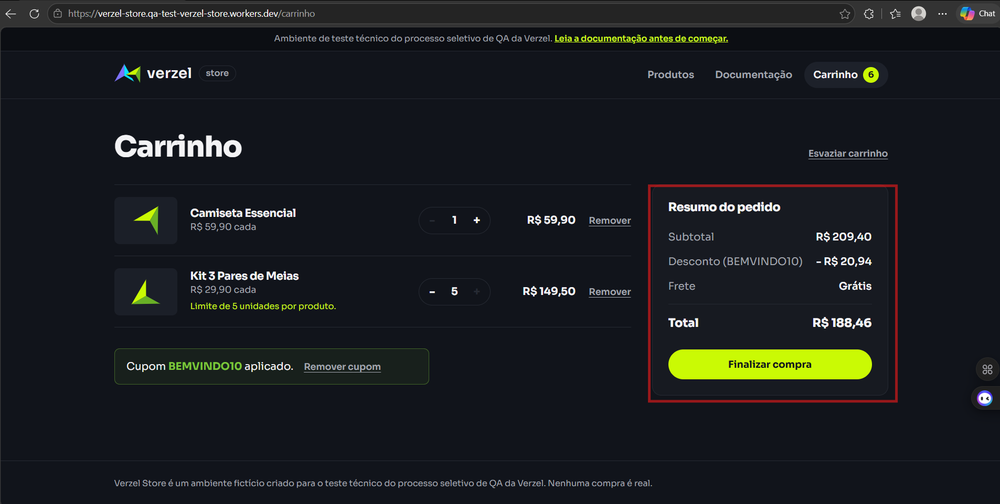
- **Bug ID:**
  Temos este BUG-001 associado que pode causar um problema nessa funcionalidade devido a regra dos limites de frete grátis.
  `../evidence/BUG-001/`
- **Status:** ⚠️ Passou com ressalva
- **Observações:**
  O comportamento da funcionalidade está aparentemente ok, entretanto se o subtotal for  "= R$ 200,00" conforme mencionado no BUG-001 o frete permanece, mesmo após o desconto, nesse caso o problema está no limite ">= R$ 200" para valores maiores que R$ 200 o comportamento segue adequado, nao cobrando frete mesmo após o desconto deixar o subtotal "< R$ 200".

---

## CT-FRT-007 — Desconto não incide sobre o frete

- **Critério:** CA09
- **Técnica:** Tabela de Decisão
- **Prioridade:** Alta
- **Pré-condições:** Subtotal abaixo de R$ 200,00; cupom disponível.
- **Dados de teste:** R$ 100,00 + `BEMVINDO10`
- **Passo a passo:**
  1. Montar R$ 100,00.
  2. Aplicar cupom.
  3. Validar desconto.
  4. Validar frete.
  5. Validar total.
- **Resultado esperado:**
  Subtotal R$ 100,00; desconto R$ 10,00; frete R$ 19,90; desconto somente sobre produtos.
- **Ponto de atenção / Dúvida:**
  Confirmar que desconto não altera frete.
- **Resultado obtido:**
  Subtotal R$ 100,00; desconto R$ 10,00; frete R$ 19,90; desconto somente sobre produtos.
- **Evidência:**
  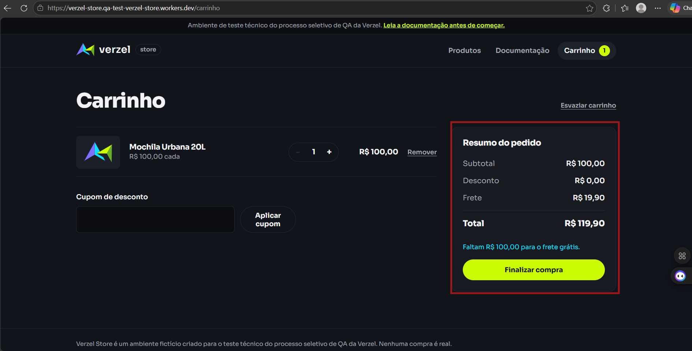
  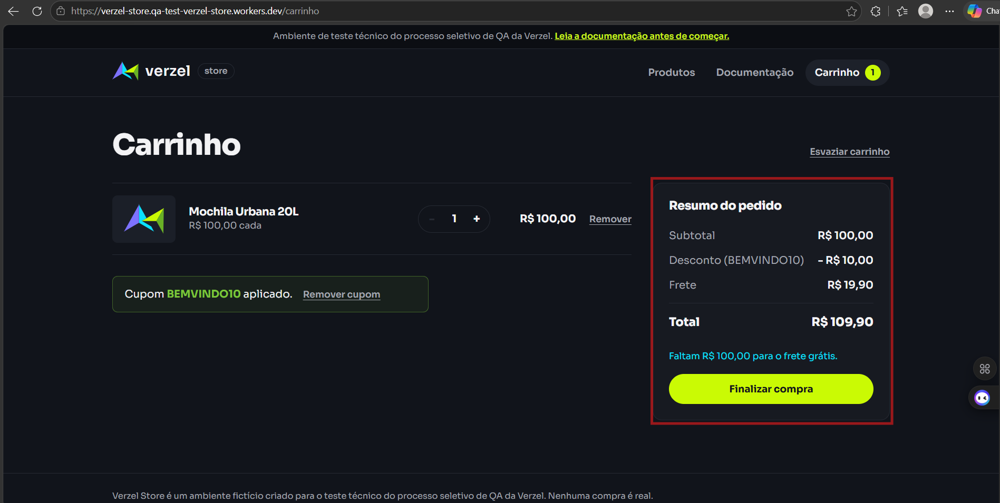
- **Status:** ✅ Passou

---

# CEN-QTD — Limite de quantidade por produto

## CT-QTD-001 — Adicionar 4 unidades

- **Critério:** CA10
- **Técnica:** Valor Limite
- **Prioridade:** Alta
- **Pré-condições:** Produto disponível.
- **Dados de teste:** Quantidade 4.
- **Passo a passo:**
  1. Adicionar produto.
  2. Ajustar para 4.
  3. Atualizar carrinho.
- **Resultado esperado:**
  Permitir 4 unidades.
- **Ponto de atenção / Dúvida:**
  Confirmar estoque disponível.
- **Resultado obtido:**
  Sistema permite adicionar 4 unidades do mesmo produto no carrinho e através da página de produtos conforme evidência abaixo.
- **Evidência:**
  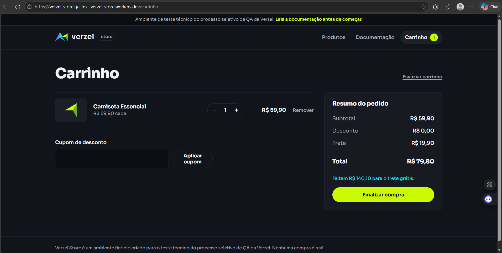
  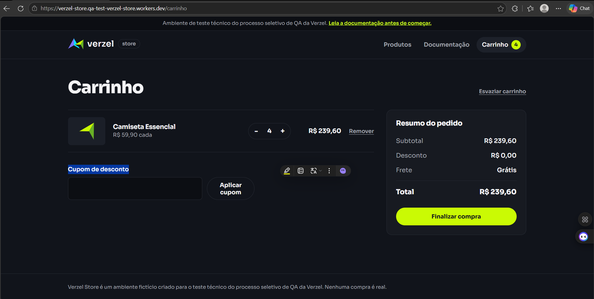
  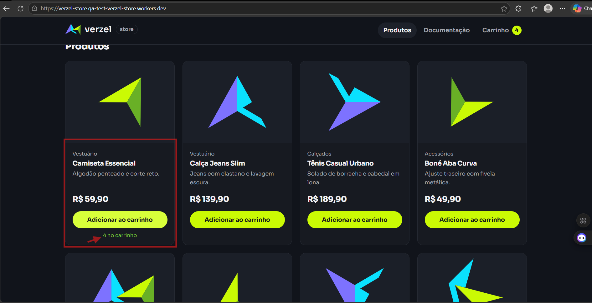
- **Status:** ✅ Passou
- **Observações:**
  N/A

---

## CT-QTD-002 — Adicionar exatamente 5 unidades

- **Critério:** CA10
- **Técnica:** Valor Limite
- **Prioridade:** Crítica
- **Pré-condições:** Produto disponível.
- **Dados de teste:** Quantidade 5.
- **Passo a passo:**
  1. Adicionar produto.
  2. Ajustar para 5.
  3. Atualizar carrinho.
- **Resultado esperado:**
  Permitir exatamente 5 unidades.
- **Ponto de atenção / Dúvida:**
  Caso crítico de fronteira.
- **Resultado obtido:**
  Sistema permite adicionar 4 unidades do mesmo produto no carrinho e através da página de produtos conforme evidência abaixo.
- **Evidência:**
  
  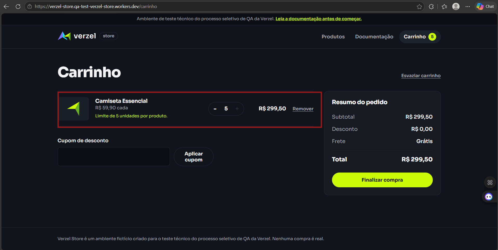
  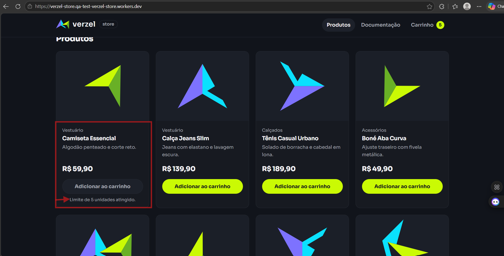
- **Status:** ✅ Passou
- **Observações:**
  N/A

---

## CT-QTD-003 — Tentar adicionar 6 unidades pela interface

- **Critério:** CA10
- **Técnica:** Valor Limite / Error Guessing
- **Prioridade:** Alta
- **Pré-condições:** Produto disponível.
- **Dados de teste:** Quantidade 6.
- **Passo a passo:**
  1. Adicionar produto.
  2. Tentar ajustar para 6 pela UI.
  3. Observar comportamento.
- **Resultado esperado:**
  UI não permite adicionar quantidade superior a 5.
- **Ponto de atenção / Dúvida:**
  Registrar comportamento real sem assumir mensagem.
- **Resultado obtido:**
  Sistema não permite adicionar mais que 5 produtos no carrinho e apresenta mensagem "Limite de 5 unidades atingido" conforme evidência abaixo.
- **Evidência:**
  
  
- **Status:** ✅ Passou
- **Observações:**
  N/A

---

## CT-QTD-004 — Solicitar 6 unidades através da API

- **Critério:** CA10
- **Técnica:** Fronteira / API
- **Prioridade:** Crítica
- **Pré-condições:** Endpoint e produto válidos disponíveis.
- **Dados de teste:** Quantidade 6 no payload.
- **Passo a passo:**
  1. Enviar requisição solicitando 6.
  2. Observar resposta.
  3. Verificar estado do pedido/carrinho.
- **Resultado esperado:**
  API impede mais de 5 unidades do mesmo produto.
- **Ponto de atenção / Dúvida:**
  Status HTTP e mensagem devem ser confirmados pela documentação/resposta real.
- **Resultado obtido:**
  Durante as requisições, conseguimos calcular o carrinho com 6 unidades do mesmo produto ou mais e inclusive realizar o pedido conforme evidência abaixo.
- **Evidência:**
    
    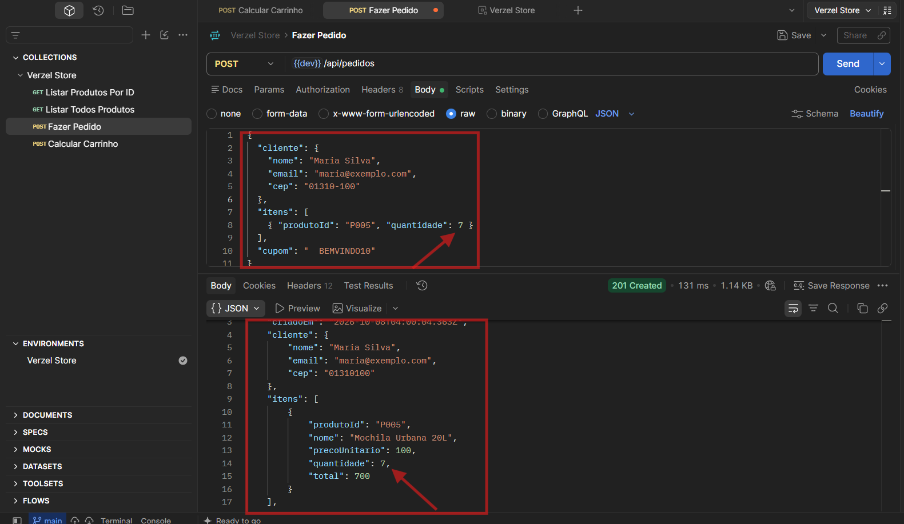
- **Bug ID:**
  BUG-002
- **Status:** ❌ Falhou
- **Observações:**
  A API permitiu calcular o carrinho com mais de 6 unidades do mesmo produto inclusive realizar o pedido.

---

## CT-QTD-005 — Solicitar exatamente 5 unidades através da API

- **Critério:** CA10
- **Técnica:** Valor Limite
- **Prioridade:** Alta
- **Pré-condições:** Endpoint e produto válidos disponíveis.
- **Dados de teste:** Quantidade 5 no payload.
- **Passo a passo:**
  1. Enviar requisição com 5.
  2. Observar resposta.
- **Resultado esperado:**
  API aceita quantidade máxima: 5.
- **Ponto de atenção / Dúvida:**
  Confirmar contrato real da API.
- **Resultado obtido:**
  *preencher durante a execução*
- **Evidência:**
  `../evidence/CT-QTD-005/`
- **Bug ID:**
  Associado BUG-002
- **Status:** ⛔ Bloqueado
- **Observações:**
  A API está aceitando qualquer quantidade de produtos > 0, conforme descrito no BUG-002

---

## CT-QTD-006 — Comparar regra de quantidade entre UI e API

- **Critério:** CA10
- **Técnica:** Consistência entre camadas
- **Prioridade:** Crítica
- **Pré-condições:** Produto e acesso UI/API disponíveis.
- **Dados de teste:** UI: 5/6; API: 5/6.
- **Passo a passo:**
  1. Validar limite 5 UI.
  2. Tentar 6 UI.
  3. Validar limite 5 API.
  4. Tentar 6 API.
  5. Comparar resultados.
- **Resultado esperado:**
  UI e API aplicam máximo 5; nenhuma camada permite contornar a regra.
- **Ponto de atenção / Dúvida:**
  Comparar mensagem, estado final e resposta HTTP quando aplicável.
- **Resultado obtido:**
  Durante a execução dos testes notamos que a UI estava apresentando o comportamento correto porém a API estava aceitando mais que 5 unidades de um mesmo produto nas rotas `/api/carrinho/calcular`;`/api/pedidos` conforme evidências abaixo.
- **Evidência:**
  
  
  
  

- **Bug ID:**
  BUG-002 | [`bugs/BUG-002/`](../bugs/BUG-002.md) 
- **Status:** ❌ Falhou
- **Observações:**
  *preencher durante a execução*

---

# CEN-VAL — Arredondamento e consistência monetária

## CT-VAL-001 — Desconto com resultado de duas casas decimais

- **Critério:** CA11
- **Técnica:** Particionamento de Equivalência
- **Prioridade:** Média
- **Pré-condições:** Carrinho com subtotal adequado.
- **Dados de teste:** Subtotal R$ 100,00.
- **Passo a passo:**
  1. Montar R$ 100,00.
  2. Aplicar `BEMVINDO10`.
  3. Conferir subtotal, desconto e total.
- **Resultado esperado:**
  Valores monetários com no máximo 2 casas; desconto R$ 10,00.
- **Ponto de atenção / Dúvida:**
  Validar padrão monetário apresentado.
- **Resultado obtido:**
  Durante a execução o carrinho apresento o arredondamento e consistência monetária conforme evidência abaixo
- **Evidência:**
  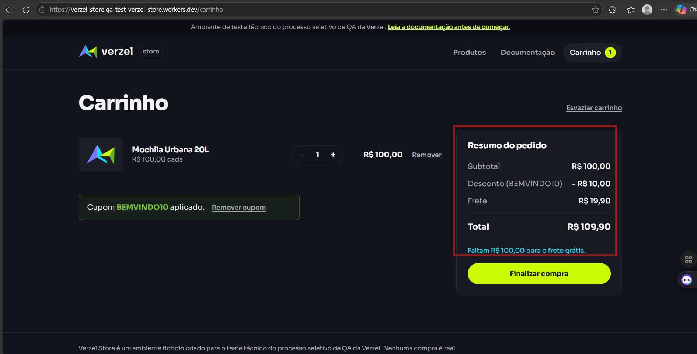

- **Status:** ✅ Passou
- **Observações:**
  *preencher durante a execução*

---

## CT-VAL-002 — Desconto que exige arredondamento

- **Critério:** CA11
- **Técnica:** Valor Limite / Error Guessing
- **Prioridade:** Média
- **Pré-condições:** Carrinho com produto/preço que gere mais de 2 casas.
- **Dados de teste:** Subtotal que produza resultado intermediário.
- **Passo a passo:**
  1. Montar subtotal adequado.
  2. Aplicar cupom.
  3. Observar cálculo.
  4. Comparar com regra/API.
- **Resultado esperado:** Valor final com no máximo 2 casas e método de arredondamento conforme aplicação.
- **Ponto de atenção / Dúvida:** Método para valores exatamente intermediários não especificado; confirmar documentação/API.
- **Resultado obtido:** O desconto foi calculado com valor intermediário superior a 2 casas decimais e o resultado apresentado pela aplicação foi normalizado para, no máximo, 2 casas decimais. O comportamento observado deve ser confrontado com a regra/API para confirmar se o arredondamento aplicado é o esperado.
- **Evidência:** 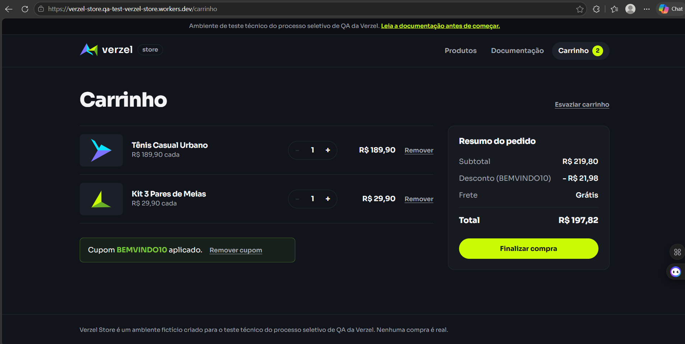
- **Status:** ⛔ Bloqueado
- **Observações:** O comportamento de arredondamento para valores exatamente intermediários não está especificado na regra fornecida. É necessário confirmar na documentação ou na API qual método de arredondamento deve ser utilizado antes de classificar o resultado como aprovado ou reprovado.

## CT-VAL-003 — Consistência dos valores do pedido

- **Critério:** CA11
- **Técnica:** Regra de Negócio
- **Prioridade:** Alta
- **Pré-condições:** Carrinho com subtotal, cupom e frete definidos.
- **Dados de teste:** Dados conforme regra aplicável.
- **Passo a passo:**
  1. Registrar subtotal.
  2. Registrar desconto.
  3. Registrar frete.
  4. Calcular Subtotal - Desconto + Frete.
  5. Comparar com total exibido/API.
- **Resultado esperado:** Subtotal, desconto, frete e total com 2 casas; total consistente e sem divergência.
- **Ponto de atenção / Dúvida:** Verificar consistência UI × API quando disponível.
- **Resultado obtido:** O total calculado a partir de subtotal - desconto + frete deve ser equivalente ao total apresentado pela aplicação/API, mantendo os valores monetários com 2 casas decimais. A validação deve considerar também a consistência entre os valores retornados pela API e os valores apresentados na UI.
- **Evidência:** `../evidence/CT-VAL-003/`
- **Bug ID:** Não identificado.
- **Status:** ⛔ Bloqueado
- **Observações:** Necessária validação conjunta dos valores de subtotal, desconto, frete e total na UI e/ou API. Caso exista divergência entre o cálculo esperado e o valor apresentado/retornado, registrar o respectivo Bug ID e evidência.

******************************************************
******************************************************
******************************************************
******************************************************

# Testes de API — Cupons, Frete, Quantidade e Valores

## CEN-CUP — Aplicação e validação de cupons pela API

### CT-API-CUP-001 — Aplicação de cupom válido

- **Critério:** CA01
- **Técnica:** Particionamento de Equivalência / API
- **Prioridade:** Alta
- **Pré-condições:** Endpoint `/api/carrinho/calcular` e produto válido disponíveis.
- **Dados de teste:** Produto P002; quantidade 1; cupom `BEMVINDO10`.
- **Passo a passo:**
  1. Enviar requisição para `/api/carrinho/calcular`.
  2. Informar produto P002 e quantidade 1.
  3. Informar o cupom `BEMVINDO10`.
  4. Observar a resposta.
  5. Validar subtotal, desconto, frete e total.
- **Resultado esperado:** API aceita o cupom; desconto de 10% sobre o subtotal; valores calculados corretamente.
- **Ponto de atenção / Dúvida:** Validar status HTTP, estrutura da resposta e valores retornados.
- **Resultado obtido:** Teste executado com sucesso status HTTP correto e valores calculados corretamente conforme evidência abaixo.
- **Evidência:** 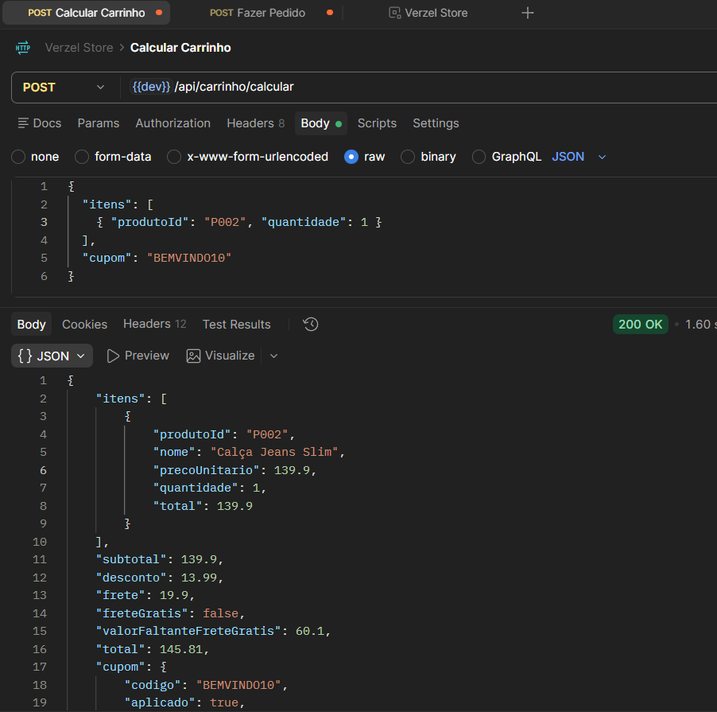
- **Status:** ✅ Passou
- **Observações:** Está consistente com `CT-CUP-001` da UI.

---

### CT-API-CUP-002 — Cupom informado em letras minúsculas

- **Critério:** CA02
- **Técnica:** Particionamento de Equivalência / API
- **Prioridade:** Média
- **Pré-condições:** Endpoint `/api/pedidos` e produto válido disponíveis.
- **Dados de teste:** Cupom `bemvindo10`.
- **Passo a passo:**
  1. Enviar requisição para `/api/carrinho/calcular`.
  2. Informar o cupom em letras minúsculas.
  3. Observar a resposta.
  4. Comparar com o resultado do cupom `BEMVINDO10`.
- **Resultado esperado:** API aceita o cupom em letras minúsculas e produz o mesmo desconto do cupom em letras maiúsculas.
- **Ponto de atenção / Dúvida:** Confirmar comportamento case-insensitive na API.
- **Resultado obtido:** Teste executado com sucesso status HTTP correto e valores calculados corretamente conforme evidência abaixo.
- **Evidência:** 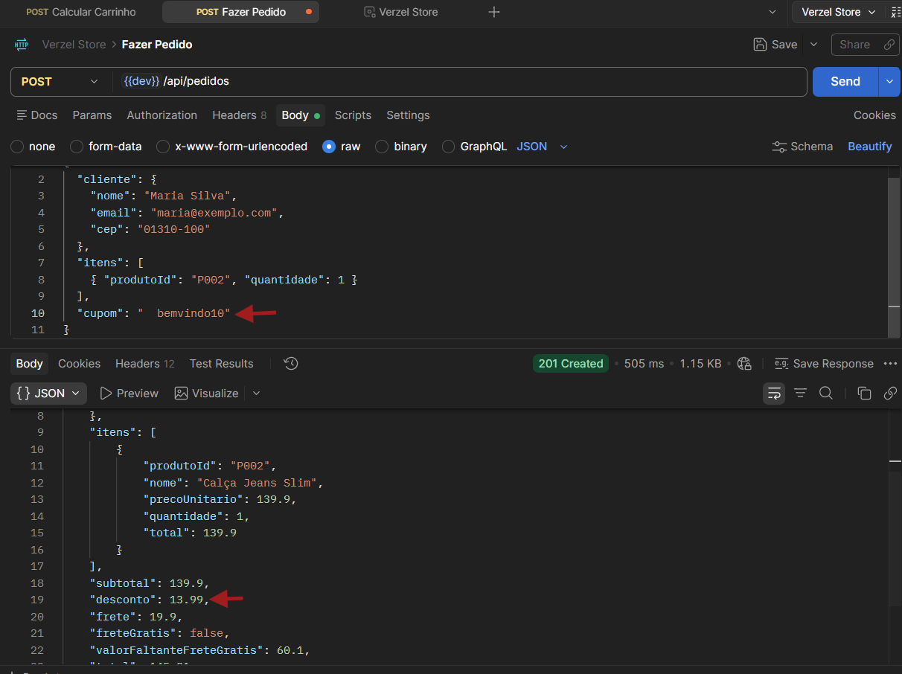
- **Status:** ✅ Passou
- **Observações:** Está consistente com `CT-CUP-002`.

---

### CT-API-CUP-003 — Cupom com espaços em branco

- **Critério:** CA02
- **Técnica:** Error Guessing / API
- **Prioridade:** Média
- **Pré-condições:** Endpoint `/api/carrinho/calcular` e produto válido disponíveis.
- **Dados de teste:** ` BEMVINDO10` e `BEMVINDO10 `.
- **Passo a passo:**
  1. Enviar requisição com espaço no início do cupom.
  2. Observar a resposta.
  3. Repetir a requisição com espaço no final.
  4. Comparar os resultados.
- **Resultado esperado:** API ignora espaços no início e no final e aceita o cupom corretamente.
- **Ponto de atenção / Dúvida:** Confirmar tratamento de whitespace na camada de API.
- **Resultado obtido:** API ignora espaços no início e no final e aceita o cupom e realiza o cálculo do desconto corretamente conforme evidência abaixo.
- **Evidência:** 

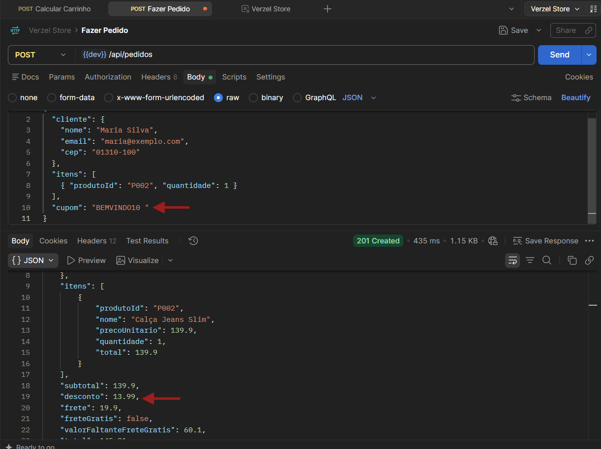
- **Status:** ✅ Passou
- **Observações:** Está consistente com `CT-CUP-003` e `CT-CUP-004`.

---

### CT-API-CUP-004 — Cupom inexistente

- **Critério:** CA03
- **Técnica:** Particionamento de Equivalência / API
- **Prioridade:** Alta
- **Pré-condições:** Endpoint `/api/pedidos` e produto válido disponíveis.
- **Dados de teste:** Cupom `CUPOMINEXISTENTE`.
- **Passo a passo:**
  1. Enviar requisição com cupom inexistente.
  2. Observar o status HTTP.
  3. Observar a mensagem retornada.
  4. Verificar desconto e total.
- **Resultado esperado:** API rejeita o cupom; retorna mensagem `Cupom inválido.`; nenhum desconto é aplicado.
- **Ponto de atenção / Dúvida:** Confirmar status HTTP e mensagem exatamente conforme regra.
- **Resultado obtido:** API recusa cupom e retorna status HTTP 422 com a mensagem "cupom inválido" conforme evidência abaixo.
- **Evidência:** 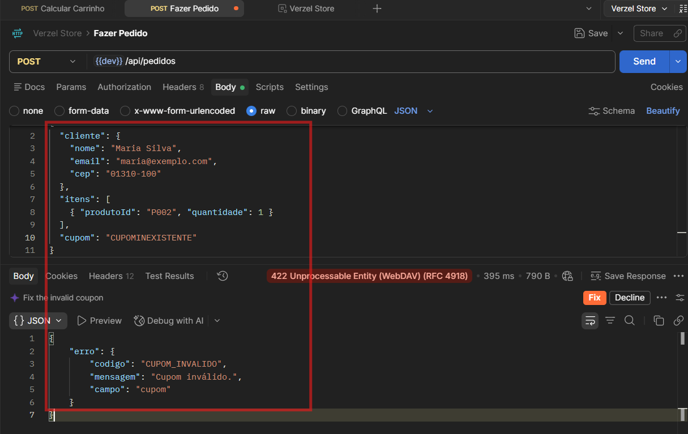
- **Status:** ✅ Passou
- **Observações:** Está consistente com `CT-CUP-005`.

---

### CT-API-CUP-005 — Cupom expirado

- **Critério:** CA04
- **Técnica:** Particionamento de Equivalência / API
- **Prioridade:** Alta
- **Pré-condições:** Endpoint `/api/pedidos` e produto válido disponíveis; cupom expirado disponível.
- **Dados de teste:** Cupom `VERAO2026`.
- **Passo a passo:**
  1. Enviar requisição com cupom expirado.
  2. Observar o status HTTP.
  3. Observar a mensagem retornada.
  4. Verificar desconto.
- **Resultado esperado:** API rejeita o cupom; retorna mensagem `Cupom expirado.`; nenhum desconto é aplicado.
- **Ponto de atenção / Dúvida:** Confirmar comportamento do cupom expirado na API.
- **Resultado obtido:** API recusa cupom e retorna status HTTP 422 com a mensagem "cupom expirado" conforme evidência abaixo.
- **Evidência:** 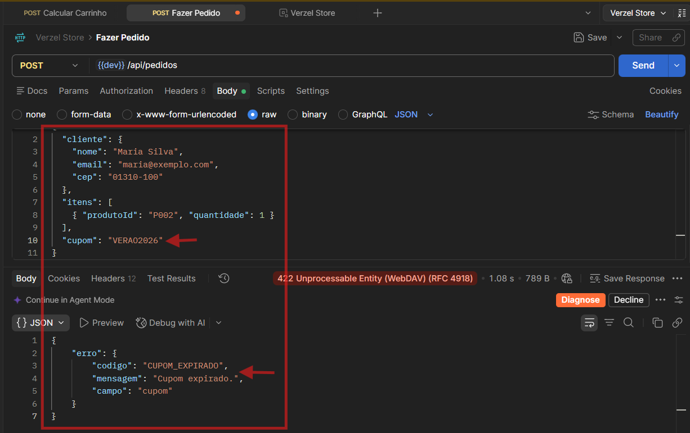
- **Status:** ✅ Passou
- **Observações:** Está consistente com `CT-CUP-006`.

---

## CEN-FRT — Cálculo e elegibilidade de frete pela API

### CT-API-FRT-001 — Subtotal abaixo do limite de frete grátis

- **Critério:** CA07
- **Técnica:** Particionamento de Equivalência / API
- **Prioridade:** Alta
- **Pré-condições:** Endpoint `/api/carrinho/calcular` e produtos válidos disponíveis.
- **Dados de teste:** Subtotal R$ 169,80.
- **Passo a passo:**
  1. Montar payload que resulte em subtotal de R$ 169,80.
  2. Enviar requisição.
  3. Observar o frete.
  4. Observar o valor faltante para frete grátis.
- **Resultado esperado:** API retorna frete de R$ 19,90 e informa que faltam R$ 30,20 para frete grátis.
- **Ponto de atenção / Dúvida:** Validar precisão do valor faltante e estrutura da resposta.
- **Resultado obtido:** API realiza o cálculo e cobra o frete corretamente retornando HTTP status 200 OK conforme evidência abaixo.
- **Evidência:** 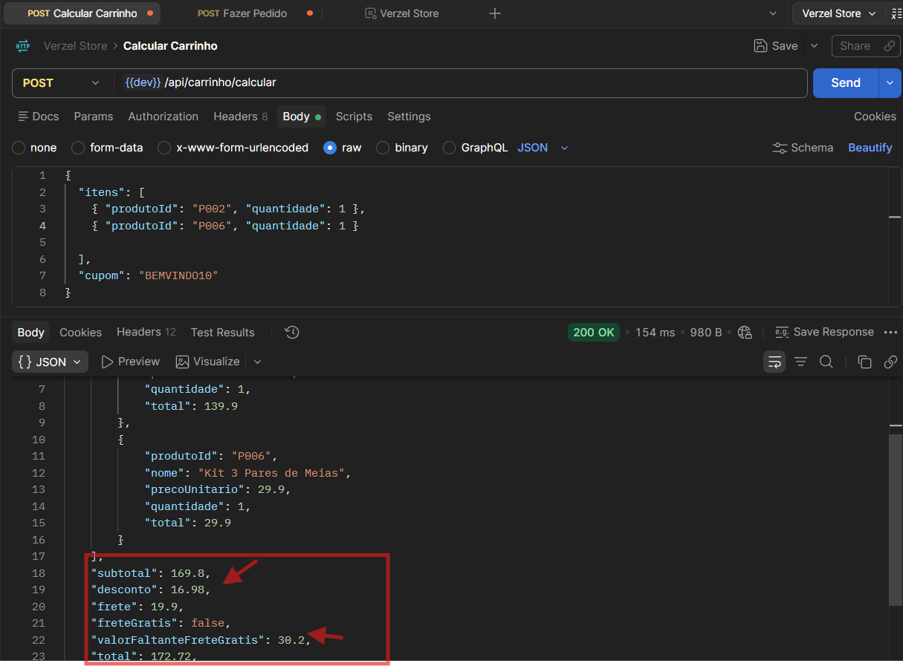
- **Status:** ✅ Passou
- **Observações:** Complementa `CT-FRT-001`.

---

### CT-API-FRT-002 — Limite exato para frete grátis

- **Critério:** CA06
- **Técnica:** Valor Limite / API
- **Prioridade:** Crítica
- **Pré-condições:** Endpoint `/api/carrinho/calcular` disponível; produtos que permitam subtotal de R$ 200,00 disponíveis.
- **Dados de teste:** Subtotal R$ 200,00.
- **Passo a passo:**
  1. Montar subtotal de R$ 200,00.
  2. Enviar requisição para a API.
  3. Observar o frete.
  4. Observar o indicador de frete grátis.
- **Resultado esperado:** API retorna frete R$ 0,00 e `freteGratis = true` para subtotal exatamente igual a R$ 200,00.
- **Ponto de atenção / Dúvida:** Caso crítico para investigação do BUG-001.
- **Resultado obtido:** Após incluir os produtos e gerar um subtotal de R$ 200,00 no carrinho a API não descontou o frete "subtotal": 200,
"desconto": 0,
"frete": 19.9,
"freteGratis": false,
A API ainda informa: "valorFaltanteFreteGratis": 0
- **Evidência:** 
- **Bug ID:** BUG-001 | [`bugs/BUG-001.md`](../bugs/BUG-001.md)
- **Status:** ❌ Falhou
- **Observações:** A falha encontrada na UI também ocorre na API.

---

### CT-API-FRT-003 — Subtotal acima do limite de frete grátis

- **Critério:** CA06
- **Técnica:** Valor Limite / API
- **Prioridade:** Alta
- **Pré-condições:** Endpoint `/api/carrinho/calcular` disponível.
- **Dados de teste:** Subtotal R$ 209,40.
- **Passo a passo:**
  1. Montar subtotal de R$ 209,40.
  2. Enviar requisição.
  3. Observar o frete.
  4. Validar o indicador de frete grátis.
- **Resultado esperado:** API retorna frete R$ 0,00 e frete grátis para subtotal superior a R$ 200,00.
- **Ponto de atenção / Dúvida:** Comparar com o comportamento observado na UI.
- **Resultado obtido:** API retorna frete R$ 0,00 e frete grátis para subtotal superior a R$ 200,00 conforme evidência abaixo.
- **Evidência:** 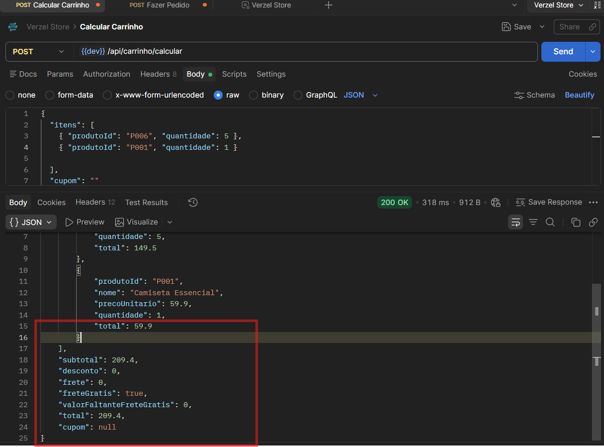
- **Status:** ✅ Passou
- **Observações:** Complementa `CT-FRT-003`.

---

### CT-API-FRT-004 — Limite imediatamente abaixo do frete grátis

- **Critério:** CA07
- **Técnica:** Valor Limite / API
- **Prioridade:** Alta
- **Pré-condições:** Endpoint `/api/carrinho/calcular` disponível; dados que permitam subtotal exato de R$ 199,99.
- **Dados de teste:** Subtotal R$ 199,99.
- **Passo a passo:**
  1. Montar subtotal de R$ 199,99.
  2. Enviar requisição.
  3. Observar o frete.
  4. Observar o valor faltante.
- **Resultado esperado:** API retorna frete R$ 19,90 e informa que falta exatamente R$ 0,01 para frete grátis.
- **Ponto de atenção / Dúvida:** O catálogo atual pode não permitir atingir exatamente R$ 199,99.
- **Resultado obtido:** *preencher durante a execução*
- **Evidência:** `../evidence/CT-API-FRT-004/`
- **Bug ID:** *preencher se aplicável*
- **Status:** ⛔ Bloqueado
- **Observações:** Manter bloqueado não existe combinação de produtos que produza o valor exato.

---

### CT-API-FRT-005 — Frete grátis baseado no subtotal antes do desconto

- **Critério:** CA08
- **Técnica:** Tabela de Decisão / Regra de Negócio / API
- **Prioridade:** Crítica
- **Pré-condições:** Endpoint `/api/carrinho/calcular`; produto e cupom disponíveis.
- **Dados de teste:** Subtotal R$ 209,40 + `BEMVINDO10`.
- **Passo a passo:**
  1. Montar subtotal de R$ 209,40.
  2. Aplicar `BEMVINDO10` pela API.
  3. Validar o desconto.
  4. Validar o frete.
  5. Validar o total.
- **Resultado esperado:** Subtotal R$ 209,40; desconto R$ 20,94; subtotal pós-desconto R$ 188,46; frete R$ 0,00; total R$ 188,46.
- **Ponto de atenção / Dúvida:** Frete deve considerar o subtotal antes do desconto.
- **Resultado obtido:** Após a execução do teste o calculo do frete considerou o subtotal antes do desconto o que está correto conforme evidência abaixo.
- **Evidência:** 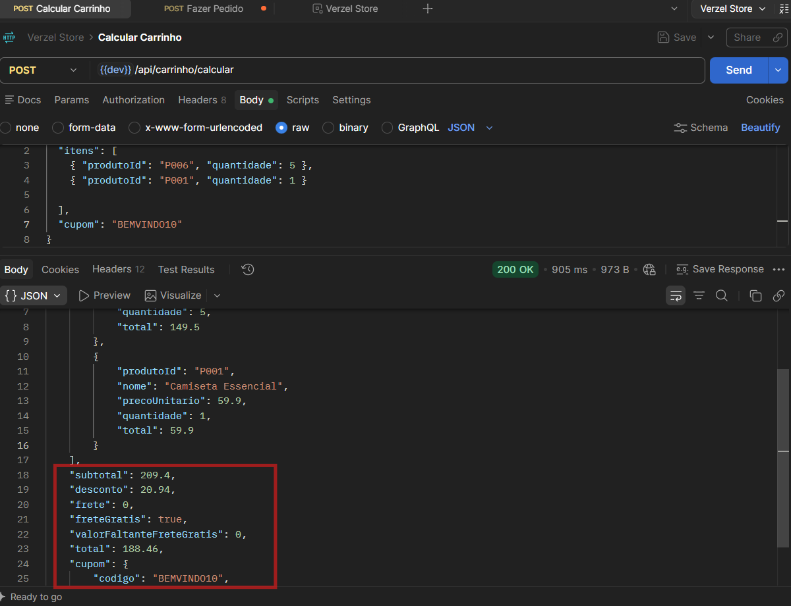
- **Status:** ✅ Passou
- **Observações:** Está consistente com `CT-FRT-006`.

---

### CT-API-FRT-006 — Frete pago após aplicação do cupom

- **Critério:** CA09
- **Técnica:** Tabela de Decisão / API
- **Prioridade:** Alta
- **Pré-condições:** Endpoint `/api/carrinho/calcular`; produto e cupom disponíveis.
- **Dados de teste:** Subtotal R$ 100,00 + `BEMVINDO10`.
- **Passo a passo:**
  1. Montar subtotal de R$ 100,00.
  2. Aplicar `BEMVINDO10`.
  3. Validar desconto.
  4. Validar frete.
  5. Validar total.
- **Resultado esperado:** Desconto de R$ 10,00 incide somente sobre produtos; frete permanece R$ 19,90; total R$ 109,90.
- **Ponto de atenção / Dúvida:** Confirmar que o desconto não altera o valor do frete.
- **Resultado obtido:** Após o teste confirmado que o desconto do cupom nao altera o valor do frete na API conforme evidência abaixo.
- **Evidência:** 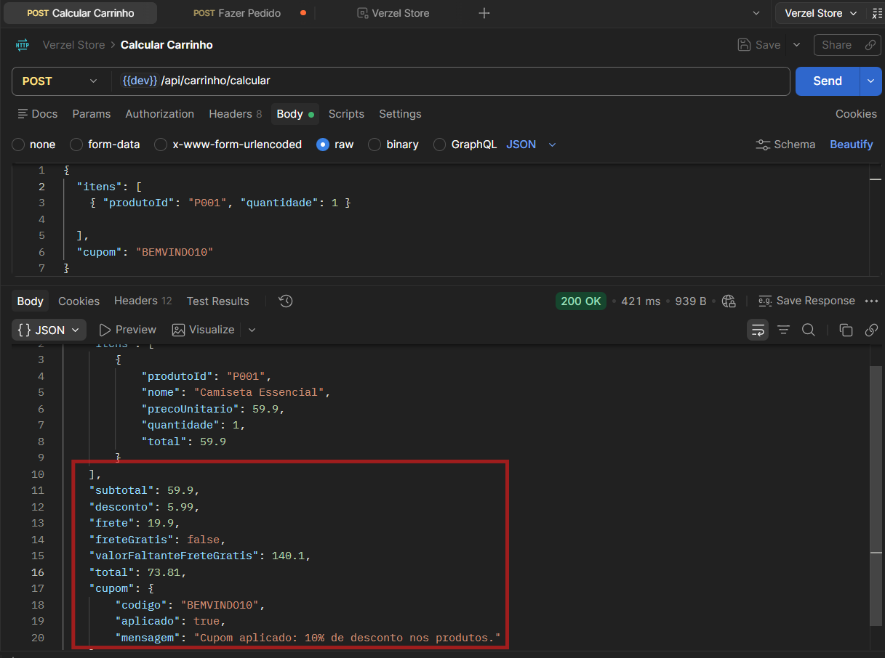
- **Status:** ✅ Passou
- **Observações:** Está consistente com `CT-FRT-007`.

---

## CEN-QTD — Limite de quantidade por produto

### CT-API-QTD-007 — Bloqueio de quantidade superior ao limite

- **Critério:** CA10
- **Técnica:** Regra de Negócio / Error Guessing / API
- **Prioridade:** Crítica
- **Pré-condições:** Endpoints `/api/pedidos` e `/api/carrinho/calcular` disponíveis e produto válido disponível.
- **Dados de teste:** Produto P002; quantidade 7.
- **Passo a passo:**
  1. Enviar requisição para `/api/carrinho/calcular` com 7 unidades do mesmo produto.
  2. Observar o status HTTP.
  3. Observar a resposta.
  4. Enviar requisição para `/api/pedidos` com 7 unidades do mesmo produto.
  5. Observar o status HTTP.
  6. Observar a resposta.
  7. Verificar se o pedido foi criado.
- **Resultado esperado:** As APIs devem impedir a utilização de mais de 5 unidades do mesmo produto. A quantidade 6 deve ser rejeitada e a criação do pedido deve ser impedida.
- **Ponto de atenção / Dúvida:** Validar status HTTP, mensagem retornada, cálculo realizado e ausência de criação do pedido.
- **Resultado obtido:** As duas rotas apresentaram o mesmo comportamento indevido. Tanto `/api/carrinho/calcular` quanto `/api/pedidos` aceitaram a quantidade de **7 unidades do produto P002**, sem aplicar o bloqueio definido em CA10. A rota `/api/pedidos` permitiu ainda a criação do pedido com quantidade superior ao limite estabelecido.

- **Evidência:** 
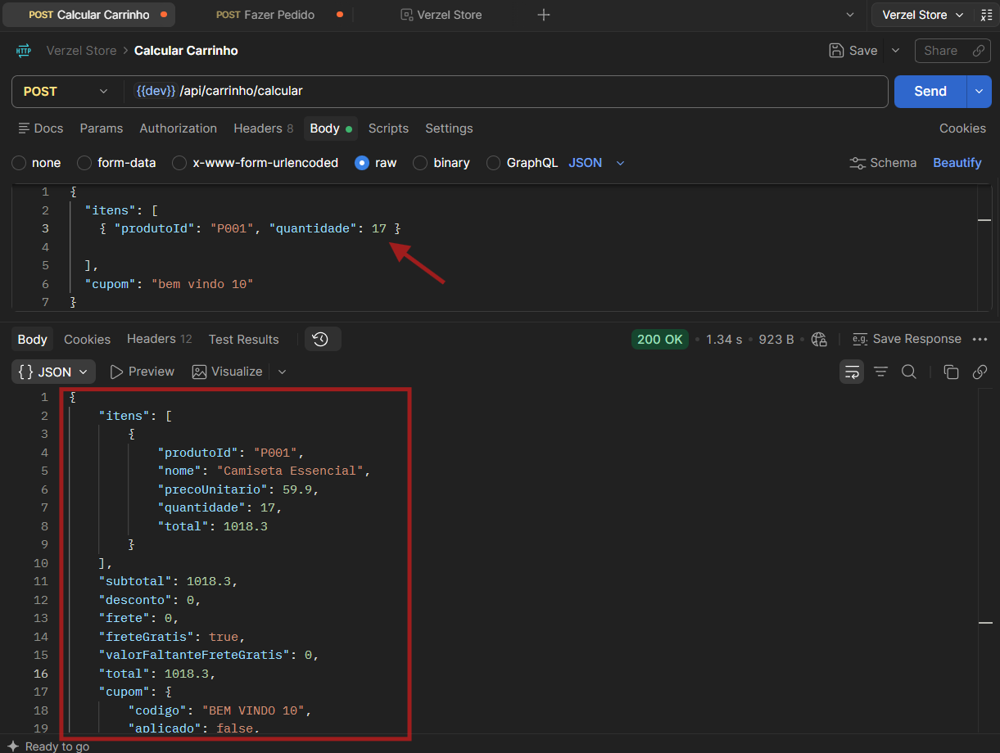
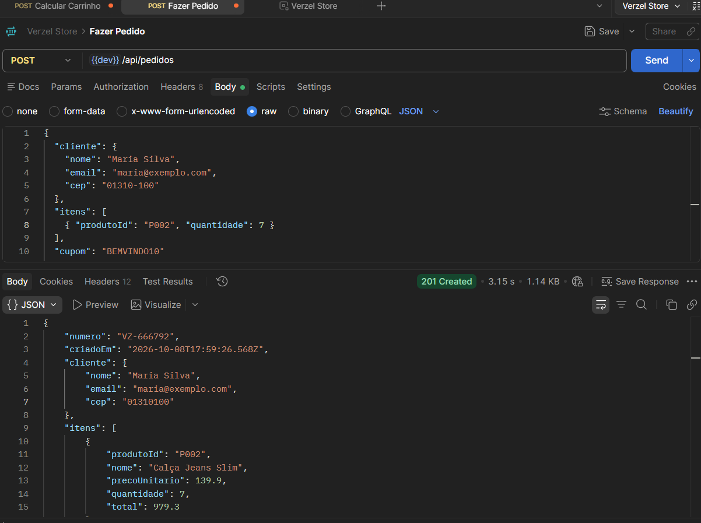

- **Bug ID:** BUG-002 | [`bugs/BUG-002.md`](../bugs/BUG-002.md)

- **Status:** ❌ Falhou

- **Observações:** O teste confirmou que a validação do limite máximo de 5 unidades não está sendo aplicada nas rotas `/api/carrinho/calcular` e `/api/pedidos`. O problema está presente na camada de API e afeta tanto o cálculo do carrinho quanto a criação do pedido. A UI apresenta comportamento diferente e bloqueia a quantidade superior ao limite.
---

## CEN-VAL — Arredondamento e consistência monetária

### CT-API-VAL-001 — Consistência dos valores monetários

- **Critério:** CA11
- **Técnica:** Regra de Negócio / API
- **Prioridade:** Alta
- **Pré-condições:** Endpoint `/api/carrinho/calcular` disponível; carrinho com subtotal, cupom e frete definidos.
- **Dados de teste:** Subtotal R$ 100,00 + `BEMVINDO10`.
- **Passo a passo:**
  1. Enviar requisição para cálculo do carrinho.
  2. Observar subtotal.
  3. Observar desconto.
  4. Observar frete.
  5. Observar total.
  6. Comparar os valores matematicamente.
- **Resultado esperado:** API retorna valores com no máximo 2 casas decimais e total consistente com `subtotal - desconto + frete`.
- **Ponto de atenção / Dúvida:** Validar consistência entre os campos retornados pela API.
- **Resultado obtido:** A API retornou subtotal de R$ 100,00, desconto de R$ 10,00, frete de R$ 19,90 e total de R$ 109,90. O cálculo foi validado matematicamente: `R$ 100,00 - R$ 10,00 + R$ 19,90 = R$ 109,90`. Os valores monetários apresentados estão dentro do limite de duas casas decimais.
- **Evidência:** 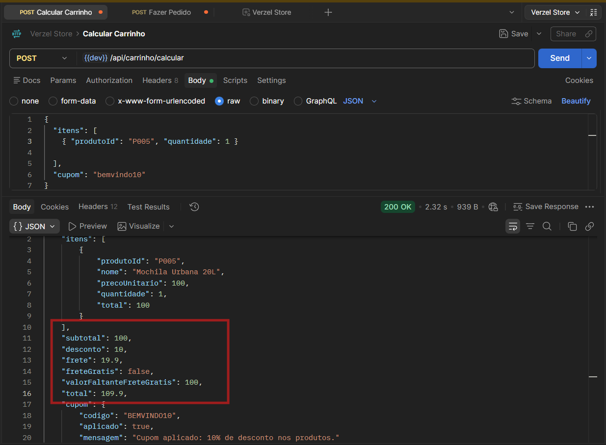
- **Status:** ✅ Passou
- **Observações:** Os valores monetários retornados pela API são consistentes entre si e o total corresponde à fórmula `subtotal - desconto + frete`. Complementa `CT-VAL-003`.

# Evidências dos bugs

| Bug | Evidência |
|---|---|
| BUG-001 | [`bugs/BUG-001.md`](../bugs/BUG-001.md) |
| BUG-002 | [`bugs/BUG-002.md`](../bugs/BUG-002.md) |

## Evidência da automação

- Relatório HTML do Playwright: gerado por `npm run report` (pasta `playwright/playwright-report`, não versionada).
- Execução no CI: _link da aba Actions do repositório_.
- Resumo da última execução local: _preencher_

